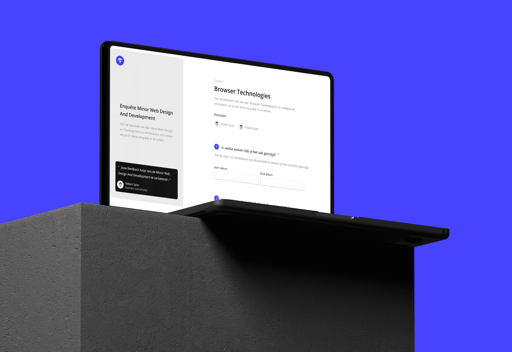

# Enquête
Een digitale, interactieve enquête website voor de Minor Webdesign And Development.

Dit is de repository van <a href="https://danianmarengo.nl">Danian Marengo</a> zijn, enquête website. Deze website is gemaakt voor het project <a href="https://github.com/cmda-minor-web/browser-technologies-2223">Browser Technologies</a>, dat deel uitmaakt van de <a href="https://github.com/cmda-minor-web">Minor Webdesign And Development 2022- 2023</a> aan de <a href="https://www.hva.nl/">Amsterdamse Hogeschool voor de Kunsten</a>, onderdeel van het programma <a href="https://www.hva.nl/opleidingen/communication-and-multimedia-design?gclid=Cj0KCQiAgaGgBhC8ARIsAAAyLfFCp5OTcBLGcx-_uMWa2sowONOebB19jLA1KMt2yEmVFGWaHdsi9DwaAq0PEALw_wcB">Communicatie en Multimedia Design.</a>

 

## Beschrijving
Voor het vak Browser Technologies zijn we voorgesteld aan het concept van "Progressive Enhancement". Onze kennis en begrip van dit principe wordt getoetst door middel van een opdracht, waarbij we een product moeten opleveren gebaseerd op een Use Case. Tijdens dit proces leren we niet alleen de kernfunctionaliteit van een Use Case te begrijpen, maar ook Progressive Enhancement en Feature Detection te begrijpen en toepassen.

We bouwen een demo op volgens het principe van Progressive Enhancement in drie lagen en houden ons aan de toegankelijkheidsrichtlijnen voor websites door aandacht te besteden aan leesbaarheid, contrast en kleur. Daarnaast zorgen we voor een gebruiksvriendelijke ervaring door affordance en directe feedback op interactieve elementen. Het eindproduct zal niet alleen aan al deze eisen voldoen, maar ook professionaliteit uitstralen.

 

## Features in de Enquête
In dit hoofdstuk zal ik uitgebreid ingaan op de features en Browser Technologies die zijn gebruikt in de enquête en hoe Progressive Enhancement is toegepast. Ik zal inzicht geven in hoe deze elementen zijn ingezet om een optimale gebruikerservaring te creëren.

 
 

## Gebruikerservaring

 

###### Feature 1

### Opdelen van het formulier
Een feature in mijn enquete is het opdelen van de formuliervelden in stappen, waardoor de gebruiker niet alle velden tegelijkertijd hoeft te invullen. Dit is handig omdat het de gebruiker overzichtelijker maakt en voorkomt dat de gebruiker overweldigd wordt door een lange lijst aan velden. Hierdoor wordt de gebruikerservaring verbetert en wordt de kans op fouten in het invullen van het formulier verminderd.

 

#### HTML
Over de HTML.

 

#### CSS
Over de CSS.

 

#### JS
Over de JS.

 
 

###### Feature 2
### Indicatie van stappen in het formulier
Een feature in mijn enquete is een indicatie van stappen, die de gebruiker laat zien in welke stap van het formulier ze zich bevinden. Dit is goed omdat het de gebruiker overzicht biedt en hen helpt bij het volgen van de voortgang. Hierdoor wordt de gebruikerservaring verbetert en wordt de kans op verwarring en fouten in het invullen van het formulier verminderd.

 

#### HTML
Over de HTML.

 

#### CSS
Over de CSS.

 

#### JS
Over de JS.

 
 

## Persoonlijke Voorkeur

 

###### Feature 3
### Licht en Donker Modus
Een feature in mijn enquete is de mogelijkheid om tussen een licht en donker modus te schakelen. Dit is goed omdat het de gebruikerservaring verbetert door aan te passen aan de voorkeur van de gebruiker en de comfortabele leesomgeving te bieden, zowel overdag als 's nachts. Hierdoor kan de gebruiker het formulier op een manier invullen die voor hen het meest comfortabel is.

 

#### HTML
Over de HTML.

 

#### CSS
Over de CSS.

 

#### JS
Over de JS.

 
 

## Validatie

 

###### Feature 1
### Studentnummer valideren
Beschrijving

 

#### HTML
Over de HTML.

 

#### CSS
Over de CSS.

 

#### JS
Over de JS.

 
 

###### Feature 1
### E- mailadres valideren
Beschrijving

 

#### HTML
Over de HTML.

 

#### CSS
Over de CSS.

 

#### JS
Over de JS.

 
 

###### Feature 1
### Start- en einddatum valideren
Beschrijving

 

#### HTML
Over de HTML.

 

#### CSS
Over de CSS.

 

#### JS
Over de JS.

 
 

## Browser Technologies in de Enquête
In dit hoofdstuk zal ik uitgebreid ingaan op de browser technologies die zijn gebruikt in de enquête en. Ik zal inzicht geven in hoe deze technologieën zijn ingezet om een optimale gebruikerservaring te creëren en hoe deze bijdragen aan het succes van de enquête.

###### Browser Technologie 1
 

### The @supports rule
Een Browser Technologie die ik heb toegepast is de @supports regel. Deze regel is toegepast om de browsercompatibiliteit te waarborgen en de stijl van de enquête op een consistente en verwachte manier te laten worden weergegeven in verschillende browsers. Hierdoor is de gebruikerservaring verbeterd en zijn er geen problemen met het correct weergeven van elementen of het correct functioneren van de enquête.

 

#### HTML
Over de HTML.

 

#### CSS
Over de CSS.

 

#### JS
Over de JS.

 
 

## Testrapport

## Mobiel

 

### Apple IOS
Beschrijving.

 

###### Mobiel Browser 1
### Google Chrome
Beschrijving

 

#### Punt 1
Punt 1

 

#### Punt 2
Punt 2

 
 

###### Mobiel Browser 2
### Safari
Beschrijving

 

#### Punt 1
Punt 1

 

#### Punt 2
Punt 2

 
 

### Android
Beschrijving.

 

###### Mobiel Browser 1
### Google Chrome
Beschrijving

 

#### Punt 1
Punt 1

 

#### Punt 2
Punt 2

 
 

###### Mobiel Browser 2
### Samsung Internet
Beschrijving

 

#### Punt 1
Punt 1

 

#### Punt 2
Punt 2

 
 

## Desktop

 

### MacOS
Beschrijving.

 

###### Desktop Browser 1
### Google Chrome
Beschrijving

 

#### Punt 1
Punt 1

 

#### Punt 2
Punt 2

 
 

###### Desktop Browser 2
### Mozilla FireFox
Beschrijving

 

#### Punt 1
Punt 1

 

#### Punt 2
Punt 2

 
 

###### Desktop Browser 3
### Flow
Beschrijving

 

#### Punt 1
Punt 1

 

#### Punt 2
Punt 2

 
 

### Windows
Beschrijving.

 

###### Desktop Browser 1
### Google Chrome
Beschrijving

 

#### Punt 1
Punt 1

 

#### Punt 2
Punt 2

 
 

###### Desktop Browser 2
### Mozilla FireFox
Beschrijving

 

#### Punt 1
Punt 1

 

#### Punt 2
Punt 2

 
 

## Credits
<ul>
  <li></li>
</ul>

 

## Miscellaneous
Follow Danian Marengo, <a href="https://www.danianmarengo.nl">Website</a>

 

## License
<a href="https://github.com/Marengd/kwoot/blob/main/LICENSE"> Mit</a>
 
Written by Danian Marengo